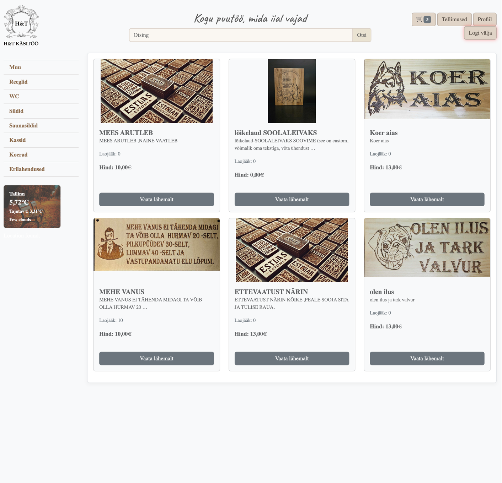

# H&T Handcraft: Final Project for SDA Python Course "PythonRemoteEE23"

### Overview  
H&T Handcraft is an e-shop platform designed to sell handcrafted products. It allows users to search for products, add them to the cart, and complete the checkout process smoothly.

---

### Technologies Used
- **Language**: Python 3.12
- **Framework**: Django 5.1
- **Database**: PostgresSQL 16.4  

---

### Features  

- **Class-Based Views (CBVs)**:  
  Extensive use of Django's generic views (`ListView`, `DetailView`, `TemplateView`, etc.) for product listings, details, and static pages.  
- **Custom Views**:  
  Custom views such as `IndexView` for the homepage and `AddToCart` for managing the cart.  
- **Authentication**:  
  `LoginRequiredMixin` is used to restrict certain views to authenticated users.  
- **Pagination**:  
  Pagination is used in product listings, with random product selection for the homepage to enhance the user experience.

---

### Installation Steps  

1. **Clone the repository**:  
    ```bash  
    git clone https://github.com/m6mmi/h-t-handcraft  
    cd h-t-handcraft  
    ```  

2. **Create a virtual environment**:  
    ```bash  
    python -m venv venv  
    source venv/bin/activate  # On Windows: venv\Scripts\activate  
    ```  

3. **Install project dependencies**:  
    ```bash  
    pip install -r requirements.txt  
    ```  

4. **Configure the environment**:  
    ```bash  
    cp .env.example .env  
    ```  

5. **Set up the database**:  
    - Ensure PostgreSQL is installed and running.  
    - Create a database named `h_t_handcraft`.  
    - Update the `.env` file with your PostgreSQL credentials. (See example.env file)

6. **Run the development server**:  
    ```bash  
    python manage.py runserver  
    ```
   
7. **Create a superuser**:

    ```bash
    python manage.py createsuperuser
    ```

8. **Admin panel**

Access the admin panel at /admin to 
- Manage products
- Categories 
- User orders

---
### Add products into the database

```bash
python manage.py makemigrations
python manage.py migrate
```

```bash
python manage.py loaddata products.json
python manage.py loaddata categories.json
```


---


### Testing  

To run the tests, use the following command:

```bash  
pytest products/tests.py  

```

---


### Credits
This project is a collaboration by:

- Janek Sitsmann (https://github.com/m6mmi) (Project Manager)
- Triinu Niklus (https://github.com/TriinuN)
- Indrek Kuusk (https://github.com/indrekkuusk)